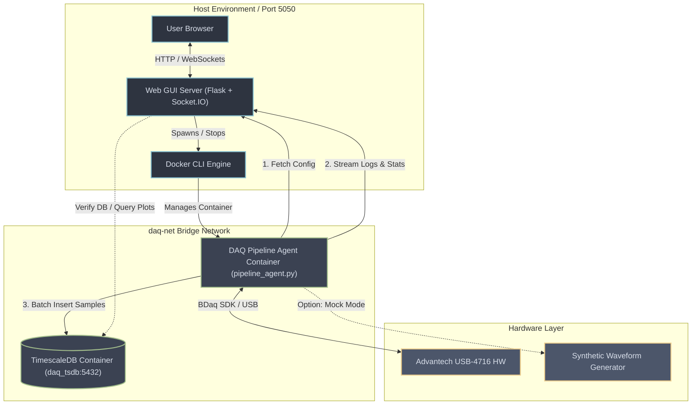

# DAQ USB-4716 — Control Center & TimescaleDB Pipeline

A real-time data acquisition pipeline and high-tech dashboard for the **Advantech USB-4716** DAQ device. Streams analog inputs directly into a local **TimescaleDB** (PostgreSQL hypertable) with zero data loss, utilizing a fully containerized pipeline architecture managed from a beautiful Web GUI interface.

---

## 🏗️ System Architecture

The project decouples the web interface and database from the time-sensitive data acquisition pipeline. The web application controls the lifecycle of a dedicated Docker container running the DAQ pipeline agent.



### 🧵 The 2-Thread Data Acquisition Loop
Inside the [pipeline_agent.py](file:///Users/faiisu/projects.nosync/DAQ-USB-4716/pipeline_agent.py) container, the acquisition runs on two isolated, dedicated threads:
1. **DAQ Reader Thread**: Polls the hardware buffer periodically. Interleaved float64 arrays are pushed immediately to an in-memory, thread-safe queue.
2. **DB Writer Thread**: Drains the queue, parses interleaved float64 values, interpolates sample timestamps, and executes bulk database writes.

> [!TIP]
> The Python queue acts as a ~100-second buffer (200 batches × 0.5s). If TimescaleDB is temporarily down, the queue buffers the data, automatically preventing data loss.

---

## 📈 Real-Time Data Flow

```mermaid
sequenceDiagram
    autonumber
    actor User as User Browser
    participant GUI as Web GUI (Flask + Socket.IO)
    participant Agent as Pipeline Container (Agent)
    database DB as TimescaleDB (daq_tsdb)

    User->>GUI: Adjust configurations (channels, clock rate)
    GUI->>GUI: Persist settings to config.py
    User->>GUI: Click "Start Pipeline"
    GUI->>GUI: Build & run daq-pipeline:latest
    activate Agent
    Agent->>GUI: GET /api/config
    GUI-->>Agent: Returns configured hardware & DB parameters
    Agent->>DB: Verify / Create schema, hypertable, indices & session
    loop Live Data Acquisition
        Agent->>Agent: Capture raw analog inputs (Hardware / Mock Waveform)
        Agent->>Agent: Push samples to Queue (with batch wall time)
        Agent->>DB: INSERT batch rows via execute_values()
        Agent->>GUI: POST /api/pipeline/stats (polling status metrics)
        Agent->>GUI: POST /api/pipeline/log (events console logs)
        GUI-->>User: Socket.IO emit("stats", stats)
        GUI-->>User: Socket.IO emit("log", log)
    end
    User->>GUI: Click "Stop Pipeline"
    GUI->>Agent: Sends SIGTERM / docker stop
    Agent->>Agent: Stop DAQ Thread
    Agent->>Agent: Flush remaining Queue items to DB
    Agent->>DB: Close Session (Update stopped_at)
    Agent-->>GUI: Disconnects
    deactivate Agent
    GUI-->>User: Pipeline Stopped status
```

---

## ✨ Features

- **High-Tech Dashboard**: Responsive dark mode panel loaded with real-time stats counters, log console terminal, and live waveform charts.
- **Glassmorphic Interactive UI**: Fully customizable mockup waveforms configuration, live database status check, and custom historical data query plotter.
- **Microsecond Precision Timestamping**: Math-derived timestamps avoid OS scheduling jitter:
  $$\text{sample\_ts} = t_{\text{batch\_wall}} - (S_{\text{count}} - 1 - s) \times \frac{1}{\text{CLOCK\_RATE}}$$
- **Containerized Pipeline**: Pipeline runner process is fully isolated in Docker, decoupling GUI server logic from real-time acquisition loops.
- **Continuous Timeline**: If a hardware or software delay drops a batch, the timeline offset is preserved so that no gaps or temporal shifts appear in the database.

---

## 📂 Project Structure

The project files are structured as follows:

*   [config.py](file:///Users/faiisu/projects.nosync/DAQ-USB-4716/config.py) — Stores hardware description, active channel counts, clock sampling rate, buffer settings, and database DSN configurations. Auto-generated and updated in-place by the Web GUI manager.
*   [pipeline_agent.py](file:///Users/faiisu/projects.nosync/DAQ-USB-4716/pipeline_agent.py) — The core acquisition daemon running inside Docker. Coordinates queue buffers, hardware (BDaq SDK) / mockup threads, and PostgreSQL batch database insertions.
*   [db_setup.sql](file:///Users/faiisu/projects.nosync/DAQ-USB-4716/db_setup.sql) — TimescaleDB database schemas, hypertable, index declarations, and initial tables bootstrap.
*   [docker-compose.yml](file:///Users/faiisu/projects.nosync/DAQ-USB-4716/docker-compose.yml) — Docker Compose services orchestrating TimescaleDB databases, port forward mappings, local data mounting, and network bridges.
*   [Dockerfile.pipeline](file:///Users/faiisu/projects.nosync/DAQ-USB-4716/Dockerfile.pipeline) — Builds the lightweight Docker environment for the Python pipeline agent.
*   [requirements.txt](file:///Users/faiisu/projects.nosync/DAQ-USB-4716/requirements.txt) — Holds Python runtime library dependencies.
*   [CommonUtils.py](file:///Users/faiisu/projects.nosync/DAQ-USB-4716/CommonUtils.py) — Minimal keyboard terminal utility helper.
*   [web_gui/](file:///Users/faiisu/projects.nosync/DAQ-USB-4716/web_gui) — Web controller center codebase:
    *   [web_gui/app.py](file:///Users/faiisu/projects.nosync/DAQ-USB-4716/web_gui/app.py) — Flask server implementing Socket.IO events, REST APIs, and client routing.
    *   [web_gui/config_manager.py](file:///Users/faiisu/projects.nosync/DAQ-USB-4716/web_gui/config_manager.py) — Handles state management and disk serialization for [config.py](file:///Users/faiisu/projects.nosync/DAQ-USB-4716/config.py).
    *   [web_gui/db.py](file:///Users/faiisu/projects.nosync/DAQ-USB-4716/web_gui/db.py) — TimescaleDB driver connections, schema verifications, and sessions helpers.
    *   [web_gui/pipeline.py](file:///Users/faiisu/projects.nosync/DAQ-USB-4716/web_gui/pipeline.py) — Interface for building the pipeline image and controlling Docker container lifecycle.
    *   [web_gui/templates/index.html](file:///Users/faiisu/projects.nosync/DAQ-USB-4716/web_gui/templates/index.html) — HTML template for the browser client dashboard.
    *   [web_gui/static/style.css](file:///Users/faiisu/projects.nosync/DAQ-USB-4716/web_gui/static/style.css) — Custom glassmorphism dark-themed style sheet.
    *   [web_gui/static/app.js](file:///Users/faiisu/projects.nosync/DAQ-USB-4716/web_gui/static/app.js) — JavaScript client driving live Socket.IO charts, forms, and control requests.
*   [old/](file:///Users/faiisu/projects.nosync/DAQ-USB-4716/old) — Repository of legacy, non-containerized standalone scripts.

---

## 🛠️ Prerequisites

Ensure you have the following installed on your system:

| Dependency | Required Version | Purpose |
|---|---|---|
| **Python** | `3.8+` | Running the Flask Web GUI backend |
| **Docker Engine & Compose** | `Latest` | Running TimescaleDB and containerized agents |
| **Advantech DAQNavi SDK** | `Installed` | *Optional*. Required only for real Advantech USB-4716 hardware data acquisition |

---

## 🚀 Quick Start (Step-by-Step)

### Step 1: Clone and Set Up Virtual Environment

Clone the repository to your local directory and initialize a virtual environment:

```bash
cd DAQ-USB-4716
python3 -m venv .venv
source .venv/bin/activate
pip install -r requirements.txt
```

### Step 2: Start TimescaleDB Service

Spin up the TimescaleDB container in background detached mode:

```bash
docker compose up -d
```

Verify that the database is running and ready:

```bash
docker compose logs -f timescaledb
# Look for: "database system is ready to accept connections"
```

### Step 3: Run the Web GUI Control Center

Launch the Flask + Socket.IO server:

```bash
python web_gui/app.py
```

Open your browser and navigate to:
👉 **[http://localhost:5050](http://localhost:5050)**

### Step 4: Start Streaming Data

1. **Mockup Mode (Testing)**:
   - On the web dashboard side navigation, choose **Waveforms** to configure synthetic signals (frequency, amplitude, DC offset).
   - Go to the **Dashboard** and click **Start Mockup**.
   - Watch live charts update on the screen. Logs and performance statistics will stream to the console in real-time.
2. **Real Hardware Mode (Production)**:
   - Ensure the Advantech USB-4716 device is plugged into the USB port.
   - Go to **Database** to verify connection, then **DAQ Config** to specify channels and rates.
   - Click **Start Real DAQ** on the dashboard.

To stop the acquisition pipeline at any point, click **Stop Pipeline**. The container will spin down, forcing the agent to flush all cached sample values inside the queue to the database before closing the acquisition session.

---

## 🎛️ Configuration Guide

Configuration values are declared inside [config.py](file:///Users/faiisu/projects.nosync/DAQ-USB-4716/config.py) and synced dynamically when changed via the Web GUI:

### Hardware Settings
- `DEVICE_DESCRIPTION`: Descriptor tag of the DAQ USB card (e.g. `'USB-4716,BID#0'`).
- `PROFILE_PATH`: Path to target XML file containing driver parameter configurations.
- `START_CHANNEL`: Index of starting analog input channel (typically `0`).
- `CHANNEL_COUNT`: Total analog input channels monitored (up to `16` single-ended).
- `CLOCK_RATE`: Clock sample rate in Hertz (samples per second).

### Buffer & Pipeline Limits
- `HARDWARE_BUFFER_SIZE`: Total capacity of physical device buffer memory (`1024` samples).
- `SECTION_LENGTH`: Length of segments read per buffer pull. Must respect the constraint:
  $$\text{SECTION\_LENGTH} \le \frac{\text{HARDWARE\_BUFFER\_SIZE}}{\text{CHANNEL\_COUNT}}$$
- `QUEUE_MAXSIZE`: Length limit of Python backup queue memory (defaults to `200` batches).

### Database Settings
- `DB_DSN`: PostgreSQL connection DSN for hardware execution mode.
- `MOCKUP_DB_DSN`: PostgreSQL connection DSN for synthetic mockup database execution.
- `DB_PAGE_SIZE`: Page block size used during batch inserts.

---

## 🔌 REST API Reference

The Web GUI Flask backend exposes the following API routes:

| Route | Method | Payload | Description |
|---|---|---|---|
| `/` | `GET` | *None* | Serves dashboard single-page HTML client |
| `/api/config` | `GET` | *None* | Fetches active hardware, waveform, and DB configuration parameters |
| `/api/config` | `POST` | `JSON` | Updates configuration, writing changes to [config.py](file:///Users/faiisu/projects.nosync/DAQ-USB-4716/config.py) |
| `/api/db/test` | `POST` | `JSON` | Verifies target DB connection DSN and returns engine version |
| `/api/pipeline/start` | `POST` | `JSON` | Instructs container manager to build and start pipeline container |
| `/api/pipeline/stop` | `POST` | *None* | Triggers graceful container stop and queue flush |
| `/api/pipeline/status`| `GET` | *None* | Inspects Docker daemon for pipeline running state |
| `/api/pipeline/log` | `POST` | `JSON` | Internal route: Used by container agent to forward messages to Flask |
| `/api/pipeline/stats` | `POST` | `JSON` | Internal route: Used by container agent to forward metrics telemetry to Flask |
| `/api/plot/static` | `POST` | `JSON` | Queries historical database records between timestamps for static plotter |
| `/api/db/channels` | `POST` | `JSON` | Retrieves list of distinct channels currently saved in the database |

---

## 🗄️ TimescaleDB Schema

The system automatically initializes two tables on the database:

### 1. Samples Table (`daq_samples`)
Optimized as a TimescaleDB hypertable partitioned on the `time` axis.

```sql
CREATE TABLE daq_samples (
    time        TIMESTAMPTZ      NOT NULL,
    channel     SMALLINT         NOT NULL,
    value       DOUBLE PRECISION NOT NULL
);
-- Hypertable partitioning
SELECT create_hypertable('daq_samples', 'time', if_not_exists => TRUE);
-- Compound Index
CREATE INDEX idx_daq_channel_time ON daq_samples (channel, time DESC);
```

### 2. Sessions Table (`daq_sessions`)
Logs every run session for tracking configurations.

```sql
CREATE TABLE daq_sessions (
    id            SERIAL PRIMARY KEY,
    started_at    TIMESTAMPTZ NOT NULL DEFAULT NOW(),
    stopped_at    TIMESTAMPTZ,
    channel_count SMALLINT    NOT NULL,
    clock_rate_hz INTEGER     NOT NULL,
    notes         TEXT
);
```

### Useful Time-Series Queries

#### 1. Group Average Sample Values per Second
```sql
SELECT time_bucket('1 second', time) AS bucket,
       channel,
       AVG(value)  AS avg_val,
       MIN(value)  AS min_val,
       MAX(value)  AS max_val
FROM daq_samples
GROUP BY bucket, channel
ORDER BY bucket DESC
LIMIT 20;
```

#### 2. Detect Gaps or Jitter Greater Than 2ms
```sql
SELECT time,
       LAG(time) OVER (ORDER BY time) AS prev_time,
       EXTRACT(EPOCH FROM (time - LAG(time) OVER (ORDER BY time))) * 1000 AS gap_ms
FROM daq_samples
WHERE channel = 0
ORDER BY time DESC;
```

---

## 🔍 Troubleshooting Matrix

> [!WARNING]
> Since the acquisition pipeline executes inside a Docker container, `localhost` DSN strings passed from the host will resolve to the container itself. Use `host.docker.internal` (automatically mapped by the deployment scripts) or specify the network alias `daq_tsdb`.

| Symptom | Probable Cause | Corrective Action |
|---|---|---|
| **Failed to deploy container: ... network not found** | Bridge network is missing | Ensure the bridge network is created. Verify using `docker network ls` or rerun `docker compose up -d`. |
| **DAQ prepare() failed** | Device not attached or incorrect identifier | Verify USB attachment. Check your device descriptor string matches the ID in **DAQ Config**. |
| **DB connection failed (from agent container)** | DB DSN points to `localhost` inside container | Ensure host-resolution aliases are configured correctly. The agent script automatically replaces `localhost` with `daq_tsdb` if it detects container execution context. |
| **BDaq SDK is not available inside this container** | BDaq drivers are only available on the host | Real DAQ mode requires the host environment to run the pipeline agent directly. Containers only support mockup waveform simulation unless USB devices and SDK volumes are mapped directly. |
| **Queue full — batch dropped** | Database writes are slower than the clock sample rates | 1. Increase `DB_PAGE_SIZE` (default `1000`) in configuration.<br>2. Reduce `CLOCK_RATE` or `CHANNEL_COUNT`. |
