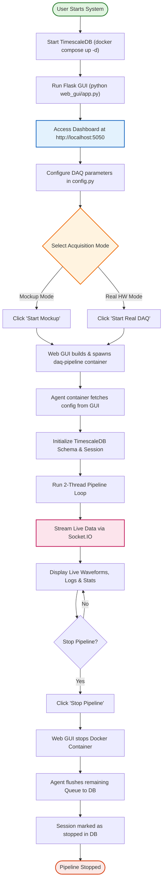
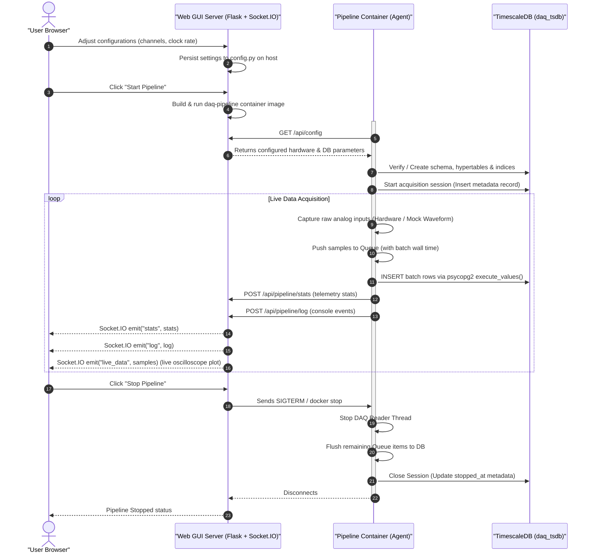

# DAQ USB-4716 — Control Center & TimescaleDB Pipeline

A real-time data acquisition pipeline and high-tech dashboard for the **Advantech USB-4716** DAQ device. Streams analog inputs directly into a local **TimescaleDB** (PostgreSQL hypertable) with zero data loss, utilizing a fully containerized pipeline architecture managed from a beautiful Web GUI interface.

---

## 🏗️ Features

- **High-Tech Dashboard**: Responsive dark mode panel loaded with real-time stats counters, log console terminal, and live waveform charts.
- **Glassmorphic Interactive UI**: Fully customizable mockup waveforms configuration, live database status check, and custom historical data query plotter.
- **Microsecond Precision Timestamping**: Math-derived timestamps avoid OS scheduling jitter:
  $$\text{sample\_ts} = t_{\text{batch\_wall}} - (S_{\text{count}} - 1 - s) \times \frac{1}{\text{CLOCK\_RATE}}$$
- **Containerized Pipeline**: Pipeline runner process is fully isolated in Docker, decoupling GUI server logic from real-time acquisition loops.
- **Continuous Timeline**: If a hardware or software delay drops a batch, the timeline offset is preserved so that no gaps or temporal shifts appear in the database.
- **Thread-safe Buffer Queue**: An in-memory backup queue buffers up to ~100 seconds of raw samples (200 batches × 0.5s) to guarantee zero data loss during database reconnects or transient network issues.

---

## 📊 System Operation Principles

### 1. User Operation Flow (Core Flow Diagram)

This flowchart visualizes the complete lifecycle of a user operation from starting the services to configuring acquisition settings, selecting the running mode, and viewing historical data.



### 2. Real-Time Data Flow (System Interaction Sequence)

The sequence diagram below displays the interactions, network calls, and data transfers between the browser, Flask controller, containerized agent, and TimescaleDB.



### 3. Technical Stack & Architecture (Layered Structure)

This diagram shows the system architecture layers, components, technologies, and dependency directions.

```mermaid
graph TD
    subgraph "Browser Layer (HTML/CSS/JS)"
        UI["Dashboard Web Client Interface"]
        Charts["Oscilloscope Live Charts (Chart.js)"]
        SioClient["Socket.IO Client Logs & Stats Receiver"]
    end

    subgraph "Web Controller Layer (Flask)"
        GUI["Web GUI Server Flask App (app.py)"]
        CfgMgr["Config Manager (config_manager.py)"]
        PipeMgr["Pipeline Deployer via Docker CLI (pipeline.py)"]
        DbModule["DB Connector & Query API (db.py)"]
    end

    subgraph "Database Layer"
        TSDB[("TimescaleDB Container (daq_tsdb)")]
        HyperTable[("Hypertable daq_samples")]
        SessionTable[("Session Log Table daq_sessions")]
    end

    subgraph "Data Acquisition Layer (Docker Container)"
        Agent["Pipeline Agent Container (pipeline_agent.py)"]
        Reader["DAQ Reader Thread (Hardware / Mockup)"]
        Queue["Thread-Safe Buffer (queue.Queue)"]
        Writer["DB Writer Thread (psycopg2 execute_values)"]
    end

    subgraph "Hardware Layer"
        BDAQ["Advantech USB-4716 Card (BDaq SDK)"]
        MockWave["Waveform Generator (Sine/Noise/Sawtooth)"]
    end

    UI -->|HTTP Requests| GUI
    SioClient <-->|WebSockets| GUI
    Charts --> UI

    GUI --> CfgMgr
    GUI --> PipeMgr
    GUI --> DbModule
    DbModule --> TSDB

    PipeMgr -->|docker run / docker stop| Agent
    Agent -->|GET /api/config| GUI
    Agent -->|POST stats & logs| GUI

    Agent --> Reader
    Agent --> Writer
    Reader -->|Interleaved float64| Queue
    Queue -->|Buffered batches| Writer
    Writer -->|Bulk INSERT (SQL)| TSDB

    Reader -->|BDaq SDK| BDAQ
    Reader -->|Mock mode| MockWave

    TSDB --> HyperTable
    TSDB --> SessionTable

    style UI fill:#e3f2fd,stroke:#1565c0,stroke-width:2px
    style GUI fill:#fff3e0,stroke:#ef6c00,stroke-width:2px
    style TSDB fill:#e1f5e1,stroke:#2e7d32,stroke-width:2px
    style Agent fill:#fce4ec,stroke:#c2185b,stroke-width:2px
    style BDAQ fill:#fbe9e7,stroke:#d84315,stroke-width:2px
```

---

## 🛠️ Prerequisites

Ensure you have the following software installed on your system before proceeding:

- ✅ **Docker Engine & Docker Compose**: For launching TimescaleDB and containerized pipeline agents.
- ✅ **Python (3.8+)**: For running the host Flask Web GUI service.
- ✅ **Advantech DAQNavi SDK** (*Optional*): Required on the host machine only if you intend to run with a real Advantech USB-4716 hardware card.

---

## 🚀 Quick Start (Step-by-Step)

Follow these steps to set up and run the data acquisition pipeline.

### Step 1: Clone and Set Up Virtual Environment

Initialize a Python virtual environment to isolate backend GUI service dependencies.

```bash
# Navigate to the project root directory
cd DAQ-USB-4716

# Create a virtual environment named .venv
python3 -m venv .venv

# Activate the virtual environment
source .venv/bin/activate

# Install the Python requirements
pip install -r requirements.txt
```

**Expected Output**:
```
Installing collected packages: urllib3, markupsafe, jinja2, itsdangerous, click, werkzeug, flask, eventlet, python-engineio, python-socketio, flask-socketio, psycopg2-binary
Successfully installed click-8.1.7 eventlet-0.36.1 flask-3.0.3 flask-socketio-5.3.6 itsdangerous-2.2.0 jinja2-3.1.4 markupsafe-2.1.5 psycopg2-binary-2.9.9 python-engineio-4.9.1 python-socketio-5.11.2 urllib3-2.2.2 werkzeug-3.0.3
```

### Step 2: Start TimescaleDB Service

Spin up the TimescaleDB docker container. This automatically initializes the network bridges and mounts storage volumes.

```bash
# Start services in the background (detached mode)
docker compose up -d
```

**Verify DB Operation**:
```bash
# Print container logs to ensure database is online
docker compose logs timescaledb
```
Look for the log output:
`database system is ready to accept connections`

> 💡 **Tip**: The database container is configured to automatically run [db_setup.sql](file:///Users/faiisu/projects.nosync/DAQ-USB-4716/db_setup.sql) on its first start, creating the `daq_samples` hypertable and indices.

### Step 3: Run the Web GUI Control Center

Launch the Flask + Socket.IO server to orchestrate pipelines and plot data.

```bash
# Start Flask GUI server
python web_gui/app.py
```

**Expected Output**:
```
2026-07-14 23:20:10 [MainThread  ] INFO:  * Serving Flask app 'app'
2026-07-14 23:20:10 [MainThread  ] INFO:  * Debug mode: off
2026-07-14 23:20:10 [MainThread  ] INFO:  * Running on http://127.0.0.1:5050 (Press CTRL+C to quit)
```

Now, open your browser and navigate to:
👉 **[http://localhost:5050](http://localhost:5050)**

### Step 4: Start Streaming Data

1. **Mockup Mode (Simulation)**:
   - Click the **Waveforms** tab in the sidebar to define synthetic sine waves (specify Amplitude, Frequency, and DC offset).
   - Return to the **Dashboard** and click **Start Mockup**.
   - Watch real-time waves render on the oscilloscope chart.
2. **Real Hardware Mode (Production)**:
   - Plug the Advantech USB-4716 device into a host USB port.
   - Go to **Database** to verify the connection DSN, and **DAQ Config** to set the start channel, count, and clock sampling rate.
   - Click **Start Real DAQ**.

To stop streaming at any time, click **Stop Pipeline** on the dashboard. This triggers a graceful shutdown where the agent flushes all remaining samples in its buffer to the database before stopping.

### Step 5: Verify System Operation

Confirm that data is successfully recorded in the TimescaleDB hypertable.

#### Method A: Test via the Web GUI Plotter
1. Go to the **Database** or **Plot** tab on the Web GUI.
2. Select target database (Mockup or Real).
3. Select channels and time ranges, then click **Query Plot**.
4. A static chart will render using historical TimescaleDB samples.

#### Method B: Verify via Command Line (cURL)
Test if the HTTP query endpoint responds with historical time-series data:

```bash
# Query the last 5 seconds of channel 0 data from the mockup database
curl -X POST http://localhost:5050/api/plot/static \
  -H "Content-Type: application/json" \
  -d '{"db_target": "mockup", "channels": [0], "last_sec": 5}'
```

**Expected Output**:
```json
{"ok": true, "data": {"0": {"times": ["2026-07-14T16:20:00.001Z", ...], "values": [2.51, ...]}}, "start": "2026-07-14T16:19:55Z", "end": "2026-07-14T16:20:00Z"}
```

---

## 🎛️ Configuration Guide

Pipeline configurations are declared inside [config.py](file:///Users/faiisu/projects.nosync/DAQ-USB-4716/config.py). When modified via the Web GUI, settings are updated on disk automatically.

### Configuration Item Classification

| Parameter Name | Category | Type | Default Value | Description |
|:---|:---|:---|:---|:---|
| `DEVICE_DESCRIPTION` | Hardware | `str` | `'USB-4716,BID#0'` | Identifier string of the target Advantech USB card. |
| `PROFILE_PATH` | Hardware | `str` | `'./profile.xml'` | File path to the XML hardware parameter profile. |
| `START_CHANNEL` | Hardware | `int` | `0` | Starting analog input channel index. |
| `CHANNEL_COUNT` | Hardware | `int` | `1` | Total active channels (Max 16 single-ended). |
| `CLOCK_RATE` | Hardware | `int` | `1000` | Sampling clock rate in Hertz (samples per second). |
| `HARDWARE_BUFFER_SIZE`| Pipeline | `int` | `1024` | Size limit of hardware buffer. |
| `SECTION_LENGTH` | Pipeline | `int` | `200` | Length of segment read per buffer pull. Must be $\le \text{HARDWARE\_BUFFER\_SIZE} / \text{CHANNEL\_COUNT}$. |
| `QUEUE_MAXSIZE` | Pipeline | `int` | `200` | Maximum batches buffer queue can hold (~100s backlog safety). |
| `DB_DSN` | Database | `str` | *DSN Connection String* | PostgreSQL DSN for real DAQ run sessions. |
| `MOCKUP_DB_DSN` | Database | `str` | *DSN Connection String* | PostgreSQL DSN for mockup/simulated run sessions. |
| `DB_PAGE_SIZE` | Database | `int` | `1000` | Chunk size of batch inserts for database performance tuning. |
| `STATS_INTERVAL_SEC` | Logging | `int` | `5` | Telemetry statistics emit interval in seconds. |

> ⚠️ **Important DSN Note**: When executing inside Docker, the pipeline agent automatically replaces `localhost` inside DSN connection strings with the database host alias `daq_tsdb` to resolve database routing properly.

---

## 🔌 API & Socket.IO Reference

### REST API Endpoints

| Endpoint | Method | Payload | Description |
|:---|:---|:---|:---|
| `/` | `GET` | *None* | Serves the dashboard single-page HTML client interface. |
| `/api/config` | `GET` | *None* | Fetches active hardware, database, and mockup waveform settings. |
| `/api/config` | `POST` | `JSON` | Updates active parameters and persists changes into `config.py`. |
| `/api/db/test` | `POST` | `JSON` | Tests the database connection and returns the PostgreSQL version. |
| `/api/pipeline/start` | `POST` | `JSON` | Compiles and starts the pipeline agent in a Docker container. |
| `/api/pipeline/stop` | `POST` | *None* | Gracefully stops the active Docker container and flushes remaining queue items. |
| `/api/pipeline/status`| `GET` | *None* | Inspects Docker to see if the containerized agent is currently active. |
| `/api/plot/static` | `POST` | `JSON` | Queries historical records from the TimescaleDB hypertable. |
| `/api/db/channels` | `POST` | `JSON` | Lists all channels present in the database. |

### Socket.IO Client Subscriptions

The backend server broadcasts real-time streams to WebSockets clients on the following channels:

- `log`: Dispatches console log strings forwarded from the pipeline container.
- `stats`: Emits pipeline telemetry performance indicators (`polled`, `enqueued`, `written`, `dropped`, `db_errors`).
- `live_data`: Streams real-time raw voltage waveforms (~4 Hz push frequency) to render oscilloscope charts.

---

## 🗄️ Database Schema & Queries

The database uses a narrow-schema layout optimized for high-write workloads.

```sql
-- Hypertable tracking raw samples
CREATE TABLE daq_samples (
    time        TIMESTAMPTZ      NOT NULL,
    channel     SMALLINT         NOT NULL,
    value       DOUBLE PRECISION NOT NULL
);

-- Convert to a TimescaleDB hypertable partitioned by time
SELECT create_hypertable('daq_samples', 'time', if_not_exists => TRUE);

-- Composite index to speed up channel-specific queries
CREATE INDEX idx_daq_channel_time ON daq_samples (channel, time DESC);

-- Session tracking table
CREATE TABLE daq_sessions (
    id            SERIAL PRIMARY KEY,
    started_at    TIMESTAMPTZ NOT NULL DEFAULT NOW(),
    stopped_at    TIMESTAMPTZ,
    channel_count SMALLINT    NOT NULL,
    clock_rate_hz INTEGER     NOT NULL,
    notes         TEXT
);
```

### Useful SQL Queries

#### Query 1: Calculate Average, Min, and Max Voltage Per Second
Aggregates time-series data using TimescaleDB's `time_bucket` function.

```sql
SELECT time_bucket('1 second', time) AS bucket,
       channel,
       AVG(value)  AS avg_val,
       MIN(value)  AS min_val,
       MAX(value)  AS max_val
FROM daq_samples
GROUP BY bucket, channel
ORDER BY bucket DESC
LIMIT 20;
```

#### Query 2: Calculate Sampling Gap Jitter (Detect Gaps > 2ms)
Evaluates hardware clock stability by measuring delta times between adjacent samples.

```sql
SELECT time,
       LAG(time) OVER (ORDER BY time) AS prev_time,
       EXTRACT(EPOCH FROM (time - LAG(time) OVER (ORDER BY time))) * 1000 AS gap_ms
FROM daq_samples
WHERE channel = 0
ORDER BY time DESC
LIMIT 100;
```

---

## 🔍 Troubleshooting Matrix

| Symptom | Probable Cause | Corrective Action |
|:---|:---|:---|
| **Failed to deploy container: ... network not found** | The `daq-net` bridge network has not been initialized. | Verify or re-run `docker compose up -d` to create the network automatically. Run `docker network ls` to verify. |
| **DB connection failed (from agent container)** | DSN connection string points to `localhost` or is invalid. | Ensure the host resolution name inside the DSN is `daq_tsdb` (the database service alias in Docker compose) instead of `localhost`. |
| **BDaq SDK is not available inside this container** | Advantech drivers and kernel interfaces are missing. | Real hardware mode requires running the acquisition logic natively on the host (where drivers are installed) instead of inside docker. Use Mock mode inside Docker or configure direct SDK volume mappings. |
| **Queue full — batch dropped** | PostgreSQL write throughput is slower than clock acquisition rate. | 1. Increase the `DB_PAGE_SIZE` parameter (e.g. `2000`) in configuration.<br>2. Reduce `CLOCK_RATE` or total `CHANNEL_COUNT`. |
| **DAQ prepare() failed** | Advantech USB-4716 card is disconnected or incorrect ID. | Check physical USB connections. Ensure the device identifier string in `config.py` (`DEVICE_DESCRIPTION`) matches the device ID in Advantech device manager. |

---

## 📂 Project Structure

Below is an overview of the codebase organization:

*   [config.py](file:///Users/faiisu/projects.nosync/DAQ-USB-4716/config.py) — Stores hardware description, active channel counts, clock sampling rate, buffer settings, and database DSN configurations. Auto-generated and updated in-place by the Web GUI manager.
*   [pipeline_agent.py](file:///Users/faiisu/projects.nosync/DAQ-USB-4716/pipeline_agent.py) — The core acquisition daemon running inside Docker. Coordinates queue buffers, hardware (BDaq SDK) / mockup threads, and PostgreSQL batch database insertions.
*   [db_setup.sql](file:///Users/faiisu/projects.nosync/DAQ-USB-4716/db_setup.sql) — TimescaleDB database schemas, hypertable, index declarations, and initial tables bootstrap.
*   [docker-compose.yml](file:///Users/faiisu/projects.nosync/DAQ-USB-4716/docker-compose.yml) — Docker Compose services orchestrating TimescaleDB databases, port forward mappings, local data mounting, and network bridges.
*   [Dockerfile.pipeline](file:///Users/faiisu/projects.nosync/DAQ-USB-4716/Dockerfile.pipeline) — Builds the lightweight Docker environment for the Python pipeline agent.
*   [requirements.txt](file:///Users/faiisu/projects.nosync/DAQ-USB-4716/requirements.txt) — Holds Python runtime library dependencies.
*   [CommonUtils.py](file:///Users/faiisu/projects.nosync/DAQ-USB-4716/CommonUtils.py) — Minimal keyboard terminal utility helper.
*   [web_gui/](file:///Users/faiisu/projects.nosync/DAQ-USB-4716/web_gui) — Web controller center codebase:
    *   [web_gui/app.py](file:///Users/faiisu/projects.nosync/DAQ-USB-4716/web_gui/app.py) — Flask server implementing Socket.IO events, REST APIs, and client routing.
    *   [web_gui/config_manager.py](file:///Users/faiisu/projects.nosync/DAQ-USB-4716/web_gui/config_manager.py) — Handles state management and disk serialization for [config.py](file:///Users/faiisu/projects.nosync/DAQ-USB-4716/config.py).
    *   [web_gui/db.py](file:///Users/faiisu/projects.nosync/DAQ-USB-4716/web_gui/db.py) — TimescaleDB driver connections, schema verifications, and sessions helpers.
    *   [web_gui/pipeline.py](file:///Users/faiisu/projects.nosync/DAQ-USB-4716/web_gui/pipeline.py) — Interface for building the pipeline image and controlling Docker container lifecycle.
    *   [web_gui/templates/index.html](file:///Users/faiisu/projects.nosync/DAQ-USB-4716/web_gui/templates/index.html) — HTML template for the browser client dashboard.
    *   [web_gui/static/style.css](file:///Users/faiisu/projects.nosync/DAQ-USB-4716/web_gui/static/style.css) — Custom glassmorphism dark-themed style sheet.
    *   [web_gui/static/app.js](file:///Users/faiisu/projects.nosync/DAQ-USB-4716/web_gui/static/app.js) — JavaScript client driving live Socket.IO charts, forms, and control requests.
*   [old/](file:///Users/faiisu/projects.nosync/DAQ-USB-4716/old) — Repository of legacy, non-containerized standalone scripts.

---

## 📄 License

This project is licensed under the MIT License. See the LICENSE file for details.
