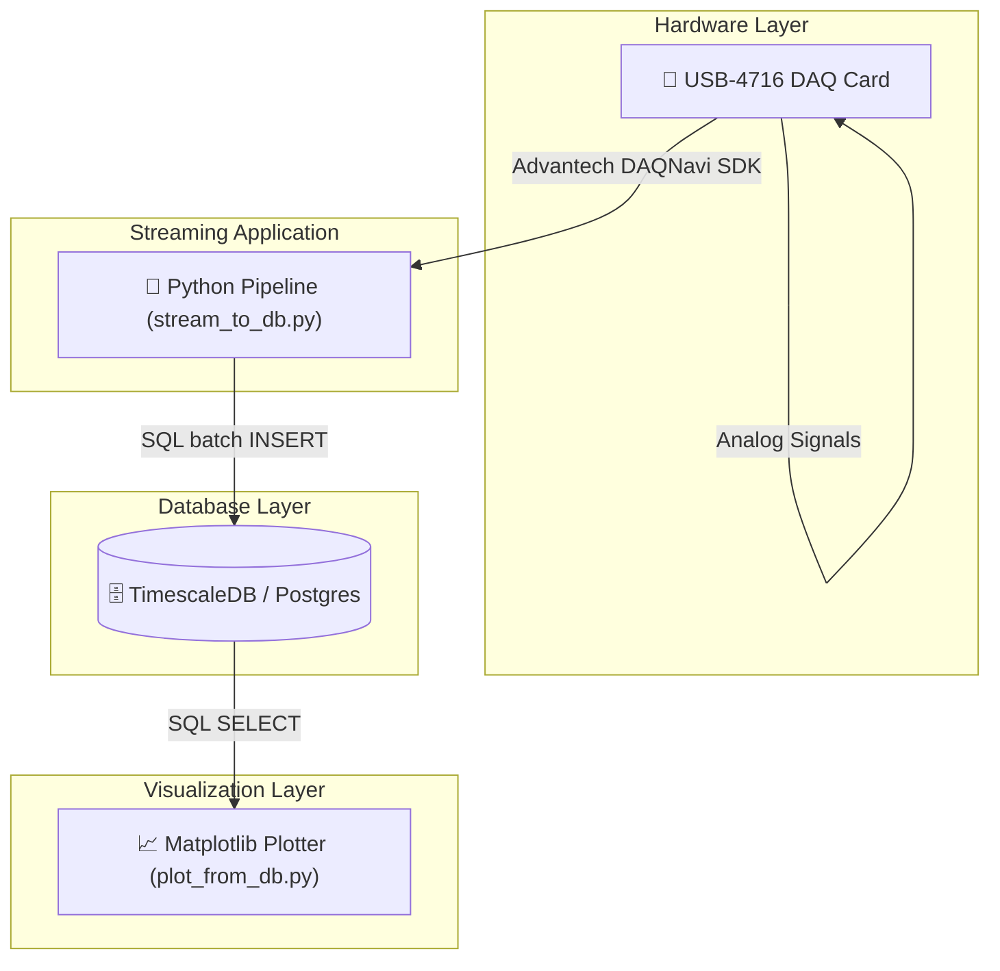

# System Context Diagram

**What this shows**: The physical DAQ hardware card (USB-4716) feeds analog signals which are read via the Advantech DAQNavi SDK by the Python streaming pipeline process (`stream_to_db.py`). The pipeline batch inserts rows into TimescaleDB, which is then queried by `plot_from_db.py` to display static or live data.
