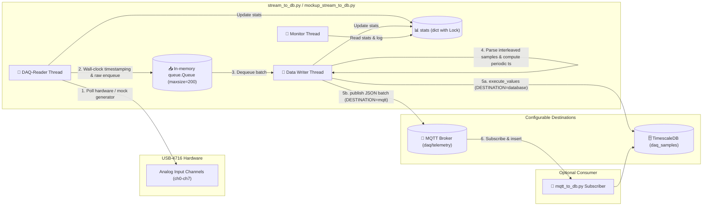

# Data Flow Diagram

**What this shows**: Data flows from the physical or synthetic analog input channels to the DAQ-Reader Thread. It is enqueued along with a wall-clock batch timestamp into a thread-safe Queue. The Data Writer Thread dequeues the batch, parses the interleaved samples, computes timestamps relative to the periodic anchor, and sends them to the configured destination (`DESTINATION` in `config.json`): either bulk inserted into TimescaleDB via `psycopg2` or published as a JSON payload to the MQTT Broker via `paho-mqtt`. An optional `mqtt_to_db.py` subscriber can bridge MQTT messages into TimescaleDB.

