# Streaming Pipeline Sequence Diagram

```mermaid
sequenceDiagram
    autonumber
    actor User
    participant Plotter as plot_from_db.py
    participant DBWriter as DB-Writer Thread
    participant Queue as data_queue (Queue)
    participant DAQReader as DAQ-Reader Thread
    participant HW as USB-4716 DAQ Card
    participant DB as TimescaleDB

    Note over DBWriter, DAQReader: Application Start
    DBWriter->>+DB: psycopg2.connect()
    DAQReader->>+HW: WaveformAiCtrl.prepare() & start()
    
    rect rgb(30, 40, 50)
        Note right of DAQReader: Acquisition Loop (per batch)
        DAQReader->>+HW: getDataF64(USER_BUFFER_SIZE, -1)
        HW-->>-DAQReader: interleaved raw data, sample count
        Note over DAQReader: Capture batch_wall_ts_ns = time.time_ns()
        DAQReader->>+Queue: put_nowait((batch_wall_ts_ns, raw_data, count))
    end

    rect rgb(40, 30, 50)
        Note left of DBWriter: Storage Loop (per batch)
        Queue->>+DBWriter: get(timeout=1.0)
        Note over DBWriter: Interleaved parsing & per-sample ts back-computation
        DBWriter->>+DB: execute_values(daq_samples, rows, page_size)
        DB-->>-DBWriter: Success / Error
        DBWriter->>DB: commit() / rollback()
    end

    rect rgb(30, 50, 40)
        Note right of Plotter: Live Plotting (FuncAnimation)
        Plotter->>+DB: SELECT time, channel, value WHERE time > since
        DB-->>-Plotter: rows
        Note over Plotter: Update rolling buffers & trim old data
        Plotter->>User: Re-render figure with updated data
    end
```

**What this shows**: The dynamic sequence of operations from initial hardware and DB connections, the parallel threads executing acquisition and storage, and the visualization plotter querying the database.
