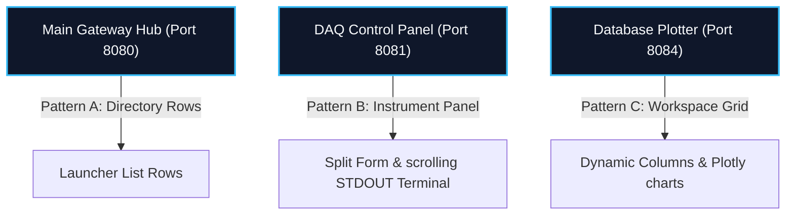

# MDDP Data Ingestion Design System: Unified Cockpit Specifications

This document defines the user interface design standards, layout patterns, and token systems for the MDDP Data Ingestion Control Center and its distributed service panels. All sub-modules, consoles, and portals must adhere to these specifications to ensure visual cohesion and a professional, unified user experience.

---

## 1. Core Visual & Aesthetic Philosophy

The MDDP interface prioritizes **high-readability, structural robustness, and responsive telemetry feedback**. It is styled as a modern **Industrial Cockpit/Instrument Console** to reflect the hardware-ingestion nature of the system (analog-to-digital signals, robot dispensers, and time-series databases).

*   **Color Theme**: Slate dark-grey background (`#121316`) paired with brand sky blue accents (`#0ea5e9`), conveying high-fidelity data tracking.
*   **Structural Rounding**: Minimal corner rounding (`6px` for structural panels/cards, `4px` for buttons, inputs, and badges) to preserve a solid, rugged hardware instrumentation feel.
*   **Micro-Animations**: Snappy, tactile transitions (e.g., border highlights, slight translation shifts, glowing pulses) to signify active telemetry states.
*   **Monitor scanlines overlay**: Translucent linear scanline masks on terminal console containers to emulate authentic CRT test equipment displays.

---

## 2. Layout Patterns

Instead of forcing a single layout style, the design system implements **three distinct functional layout patterns** tailored to the specific job of each page:

### Pattern A: Directory Portal Gateway (Horizontal Rows)
Used in the **Main Ingestion Portal** to scan, monitor, and route to decentralized hardware micro-services.
*   **Layout Structure**: Vertical stack of wide horizontal rows. Flex row items map branding icons, status badges, port numbers, descriptions, and launch buttons in a readable left-to-right flow.
*   **Primary Job**: Directories routing, active nodes audit, and gateway heartbeat logs.

### Pattern B: Control Instrument Panel (Split Form & Console)
Used in the **DAQ USB-4716 Control Console** to configure analog-to-digital parameters and verify process execution.
*   **Layout Structure**: A split layout (typically `1.1fr 1.3fr`) separating the Parameter Configuration Form (left) from Process Control Action buttons and scrolling stdout logs (right).
*   **Primary Job**: Submitting configurations, starting/stopping active ingestion loops, and auditing active log outputs.

### Pattern C: Multi-Graph Workspace Grid (Canvas Grid)
Used in the **Database Plotter Workspace** to view real-time data plots.
*   **Layout Structure**: A workspace toolbar on top (Plot selector modal and layout column controls), and a flexible grid below that re-renders into 1, 2, or 3 column sizes.
*   **Primary Job**: Initializing database queries, managing chart canvas grids, and reading interactive Plotly waveforms.

---

## 3. Color Tokens

All UI elements must construct their styles using the following curated CSS variables:

| Variable Name | Color Value | UI Role & Usage |
| :--- | :--- | :--- |
| `--bg-main` | `#121316` | Overall page background (slate-950 cool dark-grey) |
| `--bg-card` | `rgba(28, 30, 34, 0.85)` | Panel container backing (semi-transparent frosted slate) |
| `--bg-nested` | `#0f1013` | Deep terminal consoles, inputs, and form dropdowns |
| `--border-light` | `rgba(63, 71, 86, 0.3)` | Standard borders, divider lines, and card margins |
| `--border-accent` | `rgba(14, 165, 233, 0.3)` | Hover borders and active input indicators |
| `--text-primary` | `#f8fafc` | Main headings, primary values, and alert messages (slate-50) |
| `--text-secondary` | `#cbd5e1` | Secondary descriptions, labels, and paragraph body text |
| `--text-muted` | `#64748b` | Timestamps, deactivated inputs, and subtitle labels |
| `--accent-sky` | `#0ea5e9` | Primary brand blue (links, active buttons, focus boundaries) |
| `--accent-amber` | `#f59e0b` | Standby warning status (pulsing nodes, data drop warnings) |
| `--accent-emerald`| `#10b981` | Success/running status (online nodes, active acquisition) |
| `--accent-red` | `#ef4444` | Stop/offline alert status (error logs, hardware timeouts) |

---

## 4. Typography & Scales

Typography pairs wide geometric headings with highly-legible monospaced details:

*   **Display Font (Headers & UI Titles)**: `Outfit` (semi-bold `600` or heavy `800` weights, clean margins).
*   **Data & Log Font (Telemetry & Outputs)**: `JetBrains Mono` or `Consolas` (uniform spacing for columns alignment).
*   
*   **H1 Headers**: `1.15rem`, Extra-Bold (`800`), Letter-spacing `0.12em` (uppercased titles).
*   **H3 Card Headers**: `1.05rem`, Extra-Bold (`800`), Letter-spacing `0.03em`.
*   **Body Text**: `0.85rem`, Regular (`400`), Line-height `1.6`.
*   **Terminal & Labels**: `0.68rem - 0.76rem`, Monospace, Medium (`500` or `700`).

---

## 5. UI Elements & Components Rules

### A. Buttons
*   **Tactile Feedback**: Hovering on action buttons must transition background/border colors smoothly with a `0.3s` cubic-bezier easing curve.
*   **Save/Confirm Buttons**: Translucent dark backing with a thin `var(--accent-sky)` outline. Becomes filled on hover.
*   **Process Run (Start)**: Solid `var(--accent-emerald)` background with deep dark text. Glows on hover.
*   **Process Stop**: Solid `var(--accent-red)` background with white text. Glows on hover.

### B. Inputs & Selects
*   Must use `--bg-nested` backing with `--border-light` hairline borders.
*   On focus, the border must animate to `var(--accent-sky)` accompanied by a subtle `box-shadow` glow.

### C. Status Indicators
*   Must use a pulsing indicator dot mapping a matching shadow glow to denote activity levels:
    *   `pulse-dot green` (glowing `var(--accent-emerald)`) -> `active`
    *   `pulse-dot amber` (glowing `var(--accent-amber)`) -> `standby`
    *   `pulse-dot offline` / `pulse-dot red` (glowing `var(--accent-red)`) -> `offline`

### D. Plotly Charts Layout
To maintain visual alignment inside card elements, Plotly charts config must map background and gridline parameters directly to the design system tokens:
*   `paper_bgcolor`: `#0f1013` (matches `--bg-nested`)
*   `plot_bgcolor`: `#0f1013`
*   `gridcolor`: `rgba(14, 165, 233, 0.08)` (subtle translucent cyan grids)
*   `zerolinecolor`: `rgba(14, 165, 233, 0.25)`
*   `tickfont.color`: `#cbd5e1` (matches `--text-secondary`)
